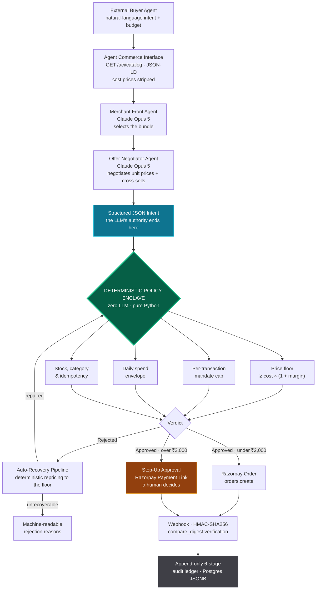

<div align="center">

#  APEX-Commerce

### **A**gentic **P**olicy & Negotiated **E**xecution E**x**change

**An end-to-end middleware bridging autonomous AI buyer agents with merchants — through machine-readable catalogs, dynamic margin-aware negotiation, and a deterministic policy enclave for safe execution.**

[](https://razorpay.com)


---

> ### The one sentence that matters
> **The AI proposes the price. A deterministic, non-LLM Python function decides whether it may be charged.**
> The language model in this system has no capability to move money. Not restricted — *incapable*.

</div>

---

##  The Problem & Our Solution

### The problem

Agentic commerce is arriving faster than the rails that should carry it. ChatGPT, Claude and a wave of autonomous shopping agents can already browse, compare and decide — but the moment they need to *transact*, everything breaks down in two directions at once:

**Merchants can't be read.** A storefront built for human eyes exposes a price and a buy button. It does not expose stock depth, volume-break tiers, substitutable accessories, or how far a price may legitimately move. An agent negotiating against an HTML page is guessing.

**Agents can't be trusted with a card.** The instinctive architecture — hand the LLM a payment API and a system prompt saying *"never spend more than ₹5,000"* — is structurally unsound. A prompt is a suggestion. Models hallucinate quantities, mis-parse currency, get talked into discounts by a persuasive counterparty, and drift under prompt injection. Any system where a probabilistic token generator holds the authority to charge a card has no defensible answer to *"what stops it from spending ₹50,000?"*

Merchants are therefore stuck choosing between invisibility to a growing buyer channel, and handing unbounded spending authority to a black box.

### Our solution

APEX-Commerce inserts a middleware layer that makes merchants **machine-readable** and agents **structurally safe**.

The negotiation is intelligent and generative — Claude Opus 5 reads a natural-language request, assembles a bundle, negotiates unit prices and cross-sells accessories, all while blind to the merchant's cost structure. It then emits a **structured JSON intent** and stops.

That intent is handed to a **Deterministic Policy Enclave**: ordinary, auditable, fully-testable Python with no model in the loop. The enclave recomputes every price against the merchant's cost basis, enforces the margin floor, checks the agent's spending mandate, and only then is a Razorpay API call constructed. If the enclave rejects the intent, **no payment API is ever contacted** — there is no code path from the model to Razorpay that does not pass through it.

The result is a system where the model's creativity is unconstrained and its authority is zero.

---

##  Architecture Flow



### The six audited stages

Every transaction writes an immutable row at each stage it reaches. Nothing is ever updated or deleted, so the ledger reads as a forensic record rather than a status field.

| # | Stage | What is captured |
|:-:|-------|------------------|
| **1** |  **Trigger** | The raw agent request, agent ID, and declared budget |
| **2** |  **Agent Reasoning** | The model's own justification, the bundle it chose, and which provider served it |
| **3** |  **Policy Evaluation** | Every rule evaluated, per-line floor math, and the verdict with reasons |
| **4** |  **Razorpay Call Payload** | The exact payload sent to Razorpay — written *only* if the enclave approved |
| **5** |  **Webhook Verification** | Signature verification result and the settled payment event |
| **6** |  **Final State** | Terminal status: `paid`, `awaiting_approval`, `failed`, or `recovered` |

>  **Reading the ledger:** a recovered transaction legitimately shows **two** stage-3 and **two** stage-6 entries — the original rejection, and the rescue that followed it. That is the append-only design working as intended, not duplicate data.

>  **Stages 5 and 6 need a webhook.** Without ngrok configured, a run stops at stage 4 — the payload was built and sent, but nothing has come back to verify. That is expected, not a gap in the ledger.

---

##  Core Features

### 1.  Agent Commerce Interface — a storefront a machine can read

A human storefront publishes a price and a button. The ACI publishes the whole decision surface: unit price, stock depth, category, substitutable accessories, and a JSON-LD representation an agent can parse without scraping HTML. Discovery starts at `/.well-known/aci.json`, which names every other endpoint — an agent needs one URL to find the rest.

**Cost prices and margin settings are stripped before the payload leaves the process.** The negotiating model cannot see the floor it is bargaining against. That is data minimisation, not a filter that could be talked around.

### 2.  Two agents, three providers, one intent

A **Merchant Front Agent** reads the request and assembles a candidate bundle. An **Offer Negotiator Agent** then works the unit prices and cross-sells accessories against the declared budget. Both run on **Claude Opus 5** through the [gorouter.app](https://gorouter.app) gateway, and both end by emitting a Pydantic-validated JSON intent — never an API call.

Underneath sits a provider chain that survives an outage without a code edit:

| Tier | Provider | Why it is there |
|:-:|----------|-----------------|
| 1 | **gorouter.app · Claude Opus 5** | Primary. Flat **per-call** billing (~0.3 credits a request), so a long negotiation costs the same as a short one — but every retry is a fresh charge, which is why `GOROUTER_MAX_ATTEMPTS` defaults to **2**, not 3. |
| 2 | **OpenRouter** | Optional middle tier. Leave `OPENROUTER_API_KEY` unset and it is skipped in silence. |
| 3 | **Gemini 2.5 Flash** | Last resort. Free, but capped at 20 requests per day per model, so it is a parachute rather than a workhorse. |

`LLM_PRIMARY_PROVIDER` flips the leader with one word in `.env`. Two hard-won details are baked in: gorouter model ids carry **no vendor prefix** (`claude-opus-5`, not `anthropic/claude-opus-5` — the prefixed form fails as `no available channel`, which reads like an outage but is a typo), and a CDN sitting in front of the gateway is detected by **response shape**, not headers. A `4xx` carrying an HTML page is a permanent edge block and is never retried; a `5xx` carrying an HTML page is an unhealthy origin and is.

When every tier is exhausted the API answers a clean **`503`** stating that no order was created and no money moved — not a 500 traceback, which is an ugly thing to have on screen in front of judges.

### 3.  The Deterministic Policy Enclave — the part with the actual authority

`backend/app/enclave/policy_rules.py` contains no model, no network call and no randomness. It takes the intent and independently recomputes everything:

- the **margin floor** per line, `ceil(cost_paise × (1 + margin))`, with any under-priced line silently pushed **up** to the floor rather than rejected
- the agent's **per-transaction cap** and **daily spend envelope**, read from a stored mandate
- **stock depth**, **category eligibility**, a **minimum order value** (Razorpay rejects anything under 100 paise), and an **empty-basket guard** that once let a ₹0 order through
- an **idempotency fingerprint** over the intent

Only on a clean verdict is a Razorpay payload constructed. There is no branch in the codebase that reaches Razorpay without passing through this function.

### 4.  Step-up human approval

Anything above **₹2,000** is not charged silently. The enclave approves the *shape* of the transaction, then mints a **Razorpay Payment Link** and parks the order at `awaiting_approval`. A person opens the link and decides. The agent's authority stops at "this basket is legal"; it never extends to "and therefore it is paid".

### 5.  Deterministic auto-recovery

Real inventory moves mid-flight. When an intent fails — the basket busts the cap, a SKU sold out, or the merchant's cost rose since the catalog was read — the request is not simply refused. A **fully deterministic** repair pipeline runs, in this order:

1. drop SKUs that no longer exist
2. clamp each quantity to the stock actually on hand
3. discount accessory lines down to — never below — their margin floor
4. keep the largest affordable subset, cheapest line first

Crucially, **recovery re-uses `policy_rules.evaluate_intent` itself as its acceptance test.** There is no second copy of the pricing rules that could drift from the first. And no LLM is involved, because this step changes prices.

The headline case: a keyboard-and-hub basket that fails a ₹5,000 mandate at **₹5,848** comes back as a **₹3,808** counter-offer with both accessories sitting exactly on their floors, and a real Payment Link attached. The original order flips to `recovered`; the ledger keeps both.

### 6.  An append-only ledger, and a dashboard that reads it

Every stage writes a new JSONB row — nothing is updated, nothing is deleted. The Next.js dashboard renders that ledger as a live audit stream: the agent's own reasoning, then the enclave's rule-by-rule verdict, then the Razorpay call, then recovery. The signature element is a **floor gauge** per line that animates the negotiated price snapping to the margin tick, so "the floor held" is something you watch rather than something you are told.

---

##  Money-Safety Invariants

These are the properties the system is built to guarantee, each one enforced in deterministic Python and asserted by the test harness.

| Invariant | Enforcement | Consequence if the model misbehaves |
|-----------|-------------|-------------------------------------|
| **No model-initiated payment** | The LLM's only output type is a validated JSON intent; the Razorpay client is not reachable from agent code | A hallucinated "charge the card" is not a thing the model can express |
| **Margin floor** | `unit_price_paise ≥ ceil(cost_paise × (1 + min_margin))`, recomputed from the merchant's own cost basis | An over-generous discount is corrected **up** to the floor, not honoured |
| **Per-transaction cap** | Mandate lookup, compared against the enclave's own recomputed total | A basket over the cap is rejected and `razorpay_order_id` is never created |
| **Daily envelope** | Sum of the agent's orders for the day, computed from order rows, not a stored counter | Splitting one big basket into many small ones does not evade the limit |
| **Human in the loop** | Payment Link + `awaiting_approval` above ₹2,000 | Large spends require a person to act |
| **Replay-safe** | SHA-256 fingerprint over **`{agent_id, sorted (sku, quantity, proposed_price)}`** | An identical **intent** replayed returns the original order. The fingerprint covers the intent, not the English sentence — so re-asking the same question and getting a differently-priced basket is legitimately a new order, not a double charge |
| **Cost blindness** | Cost and margin fields are removed from every agent-facing response | The model cannot reverse-engineer the floor to price just above it |
| **Verified webhooks** | HMAC-SHA256 with `hmac.compare_digest` | A forged settlement callback is rejected before it can mark an order paid |
| **Integer money** | Every amount is stored and compared in **paise** as an `int` | No float drift, and `ceil` on floors always rounds in the merchant's favour |

---

##  Tech Stack

| Layer | Choice | Why this one |
|-------|--------|--------------|
| **API** | Python 3.12 · FastAPI · Pydantic | Pydantic is doing safety work, not just serialisation — a malformed model reply fails validation instead of reaching the enclave |
| **Intelligence** | **Claude Opus 5** via gorouter.app | Strong enough to negotiate in natural language and still return schema-clean JSON |
| **Resilience** | gorouter → OpenRouter → Gemini 2.5 Flash | Three independent providers behind one interface; the leader is an `.env` setting |
| **Payments** | Razorpay Test Mode — Orders, Payment Links, Webhooks | Orders for the silent path, Payment Links for step-up approval, webhooks for settlement truth |
| **Database** | Neon PostgreSQL · SQLAlchemy 2.0 · JSONB | JSONB lets each audit stage keep its full payload without a migration per stage |
| **Frontend** | Next.js 15 App Router · Tailwind CSS · lucide-react | One self-contained page, JavaScript rather than TypeScript, no component-CLI dependency |
| **Security** | HMAC-SHA256 · `hmac.compare_digest` · integer paise | Constant-time comparison on webhooks; no floating-point money anywhere |
| **Tunnelling** | ngrok | Lets Razorpay reach a laptop so audit stages 5 and 6 can populate |

### Repository layout

```
apex-commerce/
├─ backend/
│  ├─ app/
│  │  ├─ main.py                  # FastAPI app, CORS, router registration
│  │  ├─ config.py                # every setting read from .env, once
│  │  ├─ catalog/
│  │  │  └─ routes.py             # /.well-known/aci.json, /aci/* — cost fields stripped here
│  │  ├─ agents/
│  │  │  ├─ gorouter_client.py    # Claude Opus 5; edge-block detection by response shape
│  │  │  ├─ openrouter_client.py  # optional middle tier
│  │  │  ├─ gemini_client.py      # last-resort tier
│  │  │  ├─ llm_router.py         # tier ordering, retries, permanent-vs-transient triage
│  │  │  ├─ llm_guard.py          # turns a total outage into a clean 503, never a traceback
│  │  │  ├─ schemas.py            # PurchaseIntent and friends — the model's only output type
│  │  │  ├─ merchant_front_agent.py
│  │  │  ├─ offer_negotiator_agent.py
│  │  │  ├─ pipeline.py           # front agent -> negotiator -> intent
│  │  │  ├─ routes.py             # /agent/negotiate, /agent/purchase, /agent/llm-status
│  │  │  └─ selftest.py           # 146 assertions, no network, no keys, no cost
│  │  ├─ enclave/
│  │  │  ├─ policy_rules.py       # ⬅ THE AUTHORITY. Zero LLM. Read this file first.
│  │  │  └─ selftest.py           # unit-level proof of the floor and cap maths
│  │  ├─ recovery/
│  │  │  ├─ recovery_rules.py     # deterministic repair ladder
│  │  │  ├─ slippage.py           # demo controls for stock and cost drift
│  │  │  ├─ pipeline.py           # repair -> re-evaluate -> counter-offer
│  │  │  ├─ routes.py             # /recovery/*
│  │  │  └─ selftest.py
│  │  ├─ payments/                # Razorpay orders, payment links, webhook HMAC verify
│  │  ├─ dashboard/
│  │  │  └─ routes.py             # merchant-side read model — the only place cost is visible
│  │  └─ database/
│  │     ├─ models.py             # Order, AuditEvent, Product, AgentMandate
│  │     ├─ session.py            # SessionLocal, get_db
│  │     └─ reset_demo.py         # wipes orders + audit rows before a recording
│  ├─ e2e_check.py                # 57 stdlib-only invariant checks over real HTTP
│  ├─ requirements.txt
│  └─ .env.example                # copy to .env — .env itself is git-ignored
└─ frontend/
   ├─ src/app/layout.js           # Inter + JetBrains Mono wired as CSS variables
   ├─ src/app/page.js             # the dashboard, one self-contained file
   ├─ src/app/landing/page.js     # the title card at /landing
   ├─ src/lib/api.js              # fetch helpers + API_BASE
   └─ tailwind.config.js
```

---

##  Local Setup Guide

Two terminals, about ten minutes. Windows PowerShell commands come first because that is what this project was built on; the macOS/Linux equivalent follows each one.

### 1 · Clone and install the backend

```powershell
git clone https://github.com/Subhra-Nandi/apex-commerce.git
cd apex-commerce\backend
python -m venv venv
.\venv\Scripts\Activate.ps1
pip install -r requirements.txt
```

```bash
git clone https://github.com/Subhra-Nandi/apex-commerce.git
cd apex-commerce/backend
python3 -m venv venv
source venv/bin/activate
pip install -r requirements.txt
```

> If PowerShell refuses to run the activate script, allow it for this session only:
> `Set-ExecutionPolicy -Scope Process -ExecutionPolicy Bypass`

### 2 · Fill in your keys

`.env` holds secrets and is git-ignored. Copy the template, then edit it:

```powershell
Copy-Item .env.example .env
notepad .env
```

```bash
cp .env.example .env
nano .env
```

Every variable is documented in the table below. The absolute minimum to boot is `DATABASE_URL`, `RAZORPAY_KEY_ID`, `RAZORPAY_KEY_SECRET`, and one LLM key.

### 3 · Start the API

```powershell
uvicorn app.main:app --reload
```

```bash
uvicorn app.main:app --reload
```

Open <http://127.0.0.1:8000/docs> for the interactive route list, and <http://127.0.0.1:8000/> for the health payload the dashboard's status dot polls.

>  **About seeding.** The demo catalog, merchant and agent mandate are seeded once by the seeder in `backend/app/database/`. `reset_demo.py` deliberately leaves those rows alone and only clears orders and audit events, so you never re-seed between demo runs.

### 4 · Start the dashboard

In a **second** terminal:

```powershell
cd apex-commerce\frontend
npm install
npm run dev
```

```bash
cd apex-commerce/frontend
npm install
npm run dev
```

Then visit <http://localhost:3000> for the dashboard and <http://localhost:3000/landing> for the title card.

### 5 · Optional: webhooks via ngrok

Without this, runs stop at audit stage 4 — the Razorpay payload is built and sent, but nothing comes back to verify. With it, stages 5 and 6 populate.

```powershell
ngrok http 8000
```

Copy the `https://` forwarding host, append the webhook path shown in `/docs`, and register that full URL in **Razorpay Dashboard → Settings → Webhooks** with the `payment.captured` and `payment.failed` events. Put the secret Razorpay shows you into `RAZORPAY_WEBHOOK_SECRET` and **restart uvicorn** — `.env` is read once at startup, so a changed secret does not take effect until you do.

>  ngrok free URLs rotate on every restart. The current one is always visible at <http://127.0.0.1:4040>.

---

##  Environment Variables

Everything lives in `backend/.env`. **That file must never be committed** — the root `.gitignore` covers `.env` and `*.env` while allowing `.env.example` through.

### Required

| Variable | What it is |
|----------|------------|
| `DATABASE_URL` | Neon PostgreSQL connection string (the pooled `?sslmode=require` one) |
| `RAZORPAY_KEY_ID` | Razorpay **Test Mode** key id |
| `RAZORPAY_KEY_SECRET` | Razorpay Test Mode secret |
| `GOROUTER_API_KEY` | gorouter.app key — this is what pays for Claude Opus 5 |

### LLM chain

| Variable | Default | What it controls |
|----------|---------|------------------|
| `LLM_PRIMARY_PROVIDER` | `gorouter` | Which tier leads: `gorouter`, `openrouter`, or `gemini`. One word swaps the whole chain. |
| `GOROUTER_PRIMARY_MODEL` | `claude-opus-5` | **No vendor prefix.** A prefixed id fails as `no available channel`. |
| `GOROUTER_MODELS` | `claude-opus-5-thinking` | Comma-separated understudies on the same gateway |
| `GOROUTER_MAX_ATTEMPTS` | `2` | Retries on a busy gateway. Low on purpose — billing is per call, so a retry costs real credit. |
| `GOROUTER_MAX_CANDIDATES` | `2` | Total gorouter models allowed in one request. Slot 0 is never trimmed. |
| `GOROUTER_BASE_URL` | `https://gorouter.app/v1` | OpenAI-dialect endpoint |
| `OPENROUTER_API_KEY` | *(unset)* | Leave empty and the middle tier is skipped silently |
| `OPENROUTER_PRIMARY_MODEL` | `anthropic/claude-sonnet-4.5` | Paid, so pinned by name |
| `OPENROUTER_FREE_FALLBACK` | `true` | Discover currently-free OpenRouter models at runtime rather than hardcoding ids that go stale |
| `GEMINI_API_KEY` | *(optional)* | Last-resort parachute. The API boots and runs fine without it. |
| `GEMINI_MODEL` | `gemini-2.5-flash` | Free tier: **20 requests per day, per model, per project**, resetting at midnight Pacific (12:30 PM IST) |

### Policy

| Variable | Default | What it controls |
|----------|---------|------------------|
| `STEP_UP_APPROVAL_THRESHOLD` | `2000` | Rupee value above which a human must approve |
| `DEFAULT_MIN_MARGIN_PERCENTAGE` | `15` | Fallback margin when a product does not specify one |
| `MAX_AGENT_DISCOUNT_PERCENTAGE` | `10` | The largest discount the negotiator may *attempt*. A hint to the model only — the enclave still enforces the real floor independently. |
| `RECOVERY_ACCESSORY_CATEGORIES` | `accessories,audio` | Which categories auto-recovery is allowed to discount |
| `RAZORPAY_WEBHOOK_SECRET` | *(optional)* | Needed for audit stages 5 and 6. Changing it requires a uvicorn restart. |
| `RAZORPAY_OFFER_ID` | *(optional)* | A Dashboard-created Offer to attach to counter-offers. Everything works without one. |

>  **Razorpay Offers cannot be created through the API on a test account** — they are made in the Dashboard. So the real discount mechanism here is our own floor-based repricing; `RAZORPAY_OFFER_ID` is merely attached when present, and `GET /recovery/offers` is read-only.

---

##  The 90-Second Demo

### Pre-flight — do not skip this

```powershell
cd apex-commerce\backend
.\venv\Scripts\Activate.ps1
python -m app.database.reset_demo --yes
```

**Why it matters:** rehearsing a basket burns its idempotency fingerprint. Re-run the same intent on camera and the API correctly returns the *stored* order, so the dashboard's policy step renders "Not evaluated" and the rejection story vanishes mid-sentence. `reset_demo` clears orders and audit rows, restarts the id sequence so the ledger looks clean, and leaves the catalog, merchant and mandate untouched.

### The five acts

| # | On screen | The line that lands |
|:-:|-----------|---------------------|
| **1** | The merchant dashboard, then the raw `/aci/catalog` JSON side by side | "The merchant sees cost and floor. The agent sees neither — those columns are removed before the payload is built, so the model is negotiating blind." |
| **2** | `Negotiate only` on a ₹7,000 budget | "Claude Opus 5 assembled the bundle, discounted it, and cross-sold an accessory. Notice what it produced: a JSON intent. Not a payment." |
| **3** | `Buy now` on the keyboard-and-hub basket against the ₹5,000 mandate | "Rejected at ₹5,848. And look at audit stage 4 — **Razorpay was never called.** Not refunded, not reversed. Never called." |
| **4** | Auto-recovery fires | "Deterministic repricing brings it to ₹3,808 with both accessories exactly on their floors, and mints a real Razorpay Payment Link. The rejection and the rescue both stay in the ledger." |
| **5** | Raise the mouse cost with `/recovery/slippage/cost` | "The merchant's cost just rose mid-flight. Watch the gauge marker slide **up** into the floor tick. The agent's old price is now illegal, and the enclave says so without anyone redeploying anything." |

### Paying for real, in Test Mode

Open the Payment Link and pay with the UPI VPA **`success@razorpay`**. Use **`failure@razorpay`** to force a failure and show the failure path.

>  The classic `4111 1111 1111 1111` test card **fails on this account** with "International cards are not supported". Use UPI. Also: Razorpay rejects orders under 100 paise, and payment-link contact numbers must not contain long runs of repeating digits.

---

##  Testing & Verification

Three layers, deliberately independent of each other.

### Layer 1 — the provider chain, offline

```powershell
python -m app.agents.selftest
```

**146 assertions across 18 sections. No network, no API keys, no cost.** It drives the router against fake transports to prove the things that only show up in an outage: that a `4xx` carrying an HTML page is classified permanent and never retried, that a `5xx` carrying an HTML page *is* retried, that an out-of-credit reply (`insufficient_user_quota`, which is **not** an HTTP 402) stops the chain instead of burning credit, that model ids are sent without a vendor prefix, and that a total failure surfaces as a clean 503.

### Layer 2 — the money maths, offline

```powershell
python -m app.enclave.selftest
python -m app.recovery.selftest
```

Unit-level proof of the floor arithmetic, the cap comparisons, the empty-basket and minimum-order guards, and the repair ladder — with no database and no HTTP.

### Layer 3 — the whole system, over real HTTP

With uvicorn already running, in a second terminal:

```powershell
python e2e_check.py
```

**57 checks, stdlib only** (`urllib` — nothing to install), asserting the invariants end to end against the live API: that the floor exceeds cost for every SKU, that **no cost field and no cost figure** leaks into any agent-facing response (two separate scans — one for field names, one for the numbers themselves, so a renamed field cannot hide a leak), that an over-cap basket is rejected **and** `razorpay_order_id` is absent, that a counter-offer both fits the cap and beats the original, that cost slippage raises the floor and never charges below it, that stock slippage is blocked pre-payment, and that audit stage indices stay within 1–6.

Three design rules are baked into that harness, each one learned from a hollow pass:

- **Assert HTTP 200 before reading any body.** A 404 body contains no cost fields, so a cost-leak scan against a wrong URL reports "clean" while inspecting `{"detail":"Not Found"}`. That is exactly how the non-existent `GET /catalog` passed for weeks.
- **Zero priced lines is a `[SKIP]`, never a `[PASS]`.** An empty envelope means the feature never ran.
- **Test idempotency at the intent, not the sentence.** Section 8 replays section 7's own `proposed_intent` through `POST /recovery/checkout`, which accepts an explicit intent and never calls a model — deterministic, schema-safe, and free.

>  **Cost of a full run:** about **10 model calls ≈ 3 gorouter credits**, so roughly 16 runs per 50 credits. The harness prints a running AI-request tally and warns in section 1 if no fallback provider is configured.
>
>  If a section reports a replay with no priced lines, the fingerprint is already burnt in your database. Clear it with `python -m app.database.reset_demo --yes` and re-run.

---

##  API Surface

### Agent-facing — machine-readable, cost-stripped

| Method | Path | Purpose |
|--------|------|---------|
| `GET` | `/.well-known/aci.json` | Discovery manifest. Names every other endpoint, so one URL bootstraps an agent. |
| `GET` | `/aci/catalog` | The catalog an agent negotiates against. **Cost and margin fields are absent.** |
| `GET` | `/aci/catalog/jsonld` | The same catalog as JSON-LD / Schema.org `Product` nodes |
| `GET` | `/aci/products/{sku}` | A single product |
| `POST` | `/agent/negotiate` | Runs both agents and returns the proposed intent. **Does not pay.** |
| `POST` | `/agent/purchase` | Proposal → enclave → Razorpay. Returns the verdict, the reasons, and the `proposed_intent` that produced it. |
| `GET` | `/agent/llm-status` | Which providers are configured and reachable. Use it as a demo pre-flight. |

>  There is no `GET /catalog`. The agent-facing paths all live under `/aci` (or `/.well-known`), and they are registered with no router prefix — the paths in `app/catalog/routes.py` are literal.

### Recovery and demo controls

| Method | Path | Purpose |
|--------|------|---------|
| `POST` | `/recovery/checkout` | Takes an explicit `PurchaseIntent` and runs enclave + recovery. **Never calls a model** — the deterministic entry point. |
| `POST` | `/recovery/agent-purchase` | The full LLM pipeline with auto-recovery attached |
| `POST` | `/recovery/slippage/stock` | Simulate a SKU selling out mid-flight |
| `POST` | `/recovery/slippage/cost` | Simulate the merchant's cost rising, which raises the floor |
| `POST` | `/recovery/slippage/reset` | Put the catalog back |
| `GET` | `/recovery/offers` | Read-only list of Razorpay Offers |

### Merchant-facing — the only place cost is visible

| Method | Path | Purpose |
|--------|------|---------|
| `GET` | `/` | Health payload. The dashboard's status dot reads this on load and after every action. |
| `GET` | `/dashboard/summary` | Live stat-card figures — never hardcoded in the frontend |
| `GET` | `/dashboard/products` | Catalog **with** cost, floor and margin |
| `GET` | `/dashboard/orders` | Order list with verdicts |
| `GET` | `/dashboard/orders/{id}` | One order plus its full audit trail |

The Razorpay webhook receiver lives in `backend/app/payments/`; its exact path is listed under the payments tag at <http://127.0.0.1:8000/docs>, which is what you append to your ngrok host. It verifies `X-Razorpay-Signature` with HMAC-SHA256 and `hmac.compare_digest` before writing audit stages 5 and 6, so an unsigned or mis-signed callback cannot mark an order paid.

---

##  Judging Criteria Alignment

**Track 01 · AI Growth & Agentic Commerce**

| Criterion | Where to look |
|-----------|---------------|
| **Innovation** | The architectural claim is narrow and testable: the LLM is not *restricted* from moving money, it is *incapable* of it. Negotiation is generative; authority is deterministic. |
| **Agentic commerce fit** | A real machine-readable commerce surface (`/.well-known/aci.json` + JSON-LD), a real negotiation loop, and a mandate model that answers "what stops it spending ₹50,000?" with a function rather than a promise |
| **Razorpay integration depth** | Orders for the silent path, Payment Links for step-up approval, Offers on counter-offers, and HMAC-verified webhooks closing the loop — four surfaces, not one |
| **Technical rigour** | 146 offline provider assertions, unit selftests for the money maths, and 57 live invariant checks. Three hollow passes were found by cross-reading the server log against a green run, and the harness was hardened so they cannot recur. |
| **Failure handling** | Slippage is a first-class scenario with a deterministic repair ladder that re-uses the enclave itself as its acceptance test — so there is no second copy of the pricing rules to drift |
| **Auditability** | Six append-only stages in JSONB. A recovered order legitimately shows two policy evaluations and two final states, because the ledger records history rather than status. |
| **Demo quality** | Cost blindness, a rejection where Razorpay was never called, an automatic rescue with a real payment link, and a floor gauge that visibly snaps — in about ninety seconds |

---

##  Roadmap

- [x] **Phase 1** — Environment, Neon schema, seeded catalog and agent mandate
- [x] **Phase 2** — Agent Commerce Interface: JSON-LD catalog, discovery manifest, cost stripping
- [x] **Phase 3** — Razorpay Orders, Payment Links, HMAC-SHA256 webhook verification
- [x] **Phase 4** — Deterministic Policy Enclave: floor, caps, daily envelope, idempotency
- [x] **Phase 5** — Two-agent negotiation engine on a three-tier provider chain
- [x] **Phase 6** — Graceful failure and deterministic auto-recovery
- [x] **Phase 7** — Next.js merchant dashboard with the animated floor gauge
- [ ] **Next** — mandate management UI, multi-merchant tenancy, signed agent identity (mTLS or JWT), and a settlement reconciliation view

---

##  Production Hardening Notes

This is a hackathon build running in Razorpay **Test Mode**. Honest list of what would have to change first:

- **Authentication.** `/recovery/slippage/*` has no auth at all — they are demo controls and must be removed or gated behind an admin role before any deployment. Agent requests should carry a signed identity (mTLS or a short-lived JWT) rather than a plain `agent_id` string.
- **CORS.** `allow_origins=["*"]` is convenient locally and unacceptable in production.
- **Rate limiting and mandate revocation.** A compromised agent key should be revocable in one call, and per-agent request rates should be capped independently of the spend envelope.
- **Secret management.** `.env` on a laptop becomes a managed secret store; webhook secrets get rotated on a schedule rather than by hand.
- **Cosmetic.** `requires_step_up` still reads `true` on rejected orders — harmless, since a rejected order has no payment path at all, but it is misleading in the JSON.

---

<div align="center">

##  License

MIT — see [`LICENSE`](LICENSE).

**Built for the Razorpay Buildathon · Track 01 · AI Growth & Agentic Commerce**

*The AI proposes the price. Deterministic code decides whether it may be charged.*

</div>
